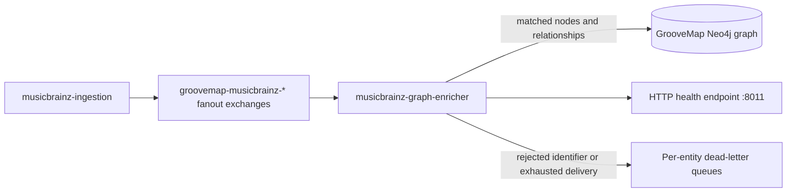

# musicbrainz-graph-enricher

`musicbrainz-graph-enricher` consumes versioned MusicBrainz catalog events and enriches
existing GrooveMap Neo4j entities with MusicBrainz metadata and relationships. It does not
create unmatched catalog entities: records and relationship endpoints without a resolved
Discogs identifier are deliberately skipped.

## Data flow



The service consumes `artists`, `labels`, `release-groups`, and `releases`. Successful
records add `mb_*` properties and MusicBrainz-sourced relationship edges to matched
`Artist`, `Label`, `Master`, and `Release` nodes. See [graph enrichment](docs/graph-enrichment.md)
for the exact outputs.

## Processing and shutdown

Each data delivery is written in its own Neo4j transaction. RabbitMQ prefetch is 200 per
consumer, so the four entity consumers can hold up to 800 unacknowledged deliveries on their
shared channel. The legacy `NEO4J_BATCH_*` variables are still read for environment
compatibility but do not alter the current per-delivery transaction model.

`file_complete` and `extraction_complete` events mark an entity stream complete and schedule
its consumer for cancellation. On process shutdown, consumers are cancelled before database
and broker teardown so new deliveries cannot churn through RabbitMQ's delivery limit. Transient
Neo4j failures are requeued with outage backoff. Records with a missing or empty `id` are
rejected without requeue; malformed JSON and other processing errors follow the generic requeue
path.

See [consumer lifecycle](docs/consumer-cancellation.md),
[completion signals](docs/file-completion-tracking.md), and
[failure handling](docs/database-resilience.md) for the operational contract.

## Configuration

Connection settings:

| Variable | Purpose |
| --- | --- |
| `NEO4J_HOST` | Required Neo4j host or complete URI |
| `NEO4J_PORT` | Port for a bare `NEO4J_HOST`; defaults to `7687` and is ignored when the host is a full URI |
| `NEO4J_USERNAME` | Required Neo4j user |
| `NEO4J_PASSWORD` | Required Neo4j password |
| `RABBITMQ_HOST` | RabbitMQ host; defaults to `rabbitmq` |
| `RABBITMQ_PORT` | RabbitMQ port; defaults to `5672` |
| `RABBITMQ_USERNAME` | RabbitMQ user; defaults to `groovemap` |
| `RABBITMQ_PASSWORD` | RabbitMQ password; defaults to `groovemap` |

Only the credential variables (`NEO4J_USERNAME`, `NEO4J_PASSWORD`, `RABBITMQ_USERNAME`, and
`RABBITMQ_PASSWORD`) support the Docker secret `_FILE` convention. Host and port variables are
read directly from the environment.

Operational tuning:

| Variable | Default | Purpose |
| --- | ---: | --- |
| `CONSUMER_CANCEL_DELAY` | `300` | Grace period before cancelling a completed stream consumer; `0` disables cancellation |
| `QUEUE_CHECK_INTERVAL` | `3600` | Interval for checking idle queues for new work |
| `STUCK_CHECK_INTERVAL` | `30` | Interval for detecting and recovering missing consumers |
| `STARTUP_IDLE_TIMEOUT` | `30` | Time without messages before entering idle mode |
| `IDLE_LOG_INTERVAL` | `300` | Idle status log interval |
| `STARTUP_DELAY` | `5` | Delay before dependency initialization |
| `MUSICBRAINZ_EXCHANGE_PREFIX` | `groovemap-musicbrainz` | Producer-owned exchange prefix |

The compatibility-only `NEO4J_BATCH_MODE`, `NEO4J_BATCH_SIZE`, and
`NEO4J_BATCH_FLUSH_INTERVAL` settings are read with defaults of `true`, `100`, and `5.0`.
They do not enable batching or change transaction size or timing.

The health endpoint is served on `http://localhost:8011/health` and identifies the service as
`musicbrainz-graph-enricher`. It never serves `/metrics`; the endpoint always answers `404`
regardless of the OpenTelemetry configuration below.

## Observability

The service pushes OpenTelemetry metrics and traces over OTLP/HTTP-protobuf via the pinned
`groovemap-runtime`. With no collector endpoint configured, its instruments and spans are
no-ops. Metrics and traces can be disabled independently. The deployment-owned collector
remote-writes metrics to VictoriaMetrics and spans to VictoriaTraces; it also owns dashboards,
retention, and backend configuration. See
[deployment observability](https://github.com/groovemap-music/deployment/blob/main/docs/observability.md)
and the accepted
[telemetry decision](https://github.com/groovemap-music/design/blob/main/docs/adr/0008-victoriametrics-tracing-runtime-alerting.md).

| Variable | Meaning | Default |
| --- | --- | --- |
| `OTEL_EXPORTER_OTLP_ENDPOINT` | Collector base URL, for example `http://otel-collector:4318`; unset disables export | unset |
| `OTEL_EXPORTER_OTLP_METRICS_ENDPOINT` | Metrics-only endpoint override | base endpoint |
| `OTEL_METRICS_EXPORTER` | `otlp` or `none` | `otlp` |
| `OTEL_METRIC_EXPORT_INTERVAL` | Push interval in milliseconds | SDK default |
| `OTEL_EXPORTER_OTLP_TRACES_ENDPOINT` | Traces-only endpoint override | base endpoint |
| `OTEL_TRACES_EXPORTER` | `otlp` or `none` | `otlp` |
| `OTEL_TRACES_SAMPLER` | Sampler name the SDK understands | `parentbased_traceidratio` |
| `OTEL_TRACES_SAMPLER_ARG` | Sampling ratio for the ratio samplers | `1.0` |
| `OTEL_SERVICE_NAME` | Overrides the `service.name` resource attribute (`brainzgraphinator`) | `brainzgraphinator` |
| `OTEL_RESOURCE_ATTRIBUTES` | Extra resource attributes, for example `service.namespace=groovemap,deployment.environment.name=dev` | empty |

`brainzgraphinator` records the following instruments, following the GrooveMap OpenTelemetry
metrics conventions (`source=musicbrainz`, `store=neo4j`):

| Metric | Instrument | Attributes |
| --- | --- | --- |
| `groovemap.pipeline.messages` | counter | `source`, `entity`, `outcome` (`processed`\|`skipped`\|`failed`) |
| `groovemap.pipeline.message.duration` | histogram, s | `source`, `entity` |
| `groovemap.pipeline.batch.size` | histogram, items | `store`, `entity` |
| `groovemap.pipeline.batch.flush.duration` | histogram, s | `store`, `entity`, `outcome` |
| `groovemap.pipeline.consumers.active` | up-down counter | `source` |

`outcome=skipped` is the common case here: a record with no resolved Discogs id is
deliberately left unenriched rather than treated as an error (see [Data flow](#data-flow)).
Each delivery writes exactly one record, so every flush reports `groovemap.pipeline.batch.size`
of `1`.

The runtime wrappers add `db.client.operation.duration`,
`groovemap.pipeline.reconnects`, process metrics, and
`groovemap.runtime.event_loop.lag`. This service records
`messaging.client.consumed.messages` and `messaging.client.operation.duration` itself because
it registers directly with `queue.consume()`. Those shared instruments and their attribute
contracts are authoritative in `groovemap-runtime` and the deployment metric catalog linked
above; they are not redefined here.

### Spans

Trace context travels in the AMQP message headers, so one MusicBrainz record's extraction,
publish, enrichment, and Neo4j write are a single trace. A delivery whose headers carry no
readable `traceparent` starts a new trace rather than failing.

| Span | Kind | Attributes | Opened by |
| --- | --- | --- | --- |
| `process {queue}` | `CONSUMER` | `messaging.system`, `messaging.destination.name`, `messaging.operation.name`, `error.type` on failure | this service, per delivery, as a child of the publisher's span |
| `flush neo4j {entity}` | `INTERNAL` | `db.system.name`, `groovemap.entity`, `outcome` (`committed`\|`failed`), `error.type` on failure | this service, around the write, linked to the message spans in the batch |
| `session neo4j` | `CLIENT` | `db.system.name`, `db.operation.name`, `error.type` on failure | `AsyncResilientNeo4jDriver`, nested inside the flush span |

`common.run_delivery` is the sole terminal ACK/NACK authority. The service keeps its
MusicBrainz-specific validation, failure classifier, counters, and consumer-span observer local;
fixes to settlement ordering, cancellation, or exactly-once behavior belong in
`common.delivery` so every direct consumer receives the same repair. Each delivery writes
exactly one record, so a flush links exactly one member message span; `common.flush_span` caps
the links at 64 for batching consumers. A failure sets span status `ERROR` with `error.type`
only: never a message, a stack trace, or a span event carrying a payload. Call counts and
durations per span name are derived by the collector's `spanmetrics` connector, never emitted
here.

## Development

**Public-library cutover: complete.** The service consumes the shared `groovemap-runtime`
package from the public `groovemap-music/python-libraries` repository at the immutable revision
recorded in `pyproject.toml` and `uv.lock`. Local setup and CI fetch that source without
private-package credentials.

```bash
mise install
just setup
just check
just test-integration
just audit
just image
```

`just check` runs the locked format, lint, contract, type, coverage, secret, package,
installation, license, and version-preview checks against mocked RabbitMQ and Neo4j
boundaries. `just test-integration` starts a disposable Neo4j container from
`neo4j:2026-community@sha256:dbc377fb9cd8fe8dabc19d3041b197d5ca0ef8bae514cea175b8df265e5b7a76`,
binds its random Bolt port to loopback, proves the shared delivery contract against real
transactions, and removes the container on exit; it needs Docker but no operator credentials.
See [integration testing](docs/integration-testing.md). `just audit` is the dedicated locked
dependency audit. `just image` builds and inspects `musicbrainz-graph-enricher:local`.
`just release-dry-run` reruns the full check and builds local release evidence; publishing,
tagging, and pushing remain separate operations.

## Contracts and compatibility

The v1 catalog-event contract is promoted byte-for-byte from
[`musicbrainz-ingestion`](https://github.com/groovemap-music/musicbrainz-ingestion), and the
persistence contract is promoted from
[`database-schema`](https://github.com/groovemap-music/database-schema). `just source-check`
verifies the promoted artifacts and generated binding.

Some internal names remain intentionally unchanged because they are compatibility boundaries:

- `brainzgraphinator` is the Python package name and the v1 AMQP consumer identifier. Existing
  durable queue, dead-letter exchange, and dead-letter queue names include this token.
- `BrainzgraphinatorConfig` is the internal configuration class used by existing imports.

These identifiers are not the public service identity. Runtime logs, health data, image metadata,
the console command, and documentation use `musicbrainz-graph-enricher`.

## Documentation

- [Documentation index](docs/README.md)
- [Graph enrichment](docs/graph-enrichment.md)
- [MusicBrainz event flow](docs/musicbrainz-sync.md)
- [Consumer lifecycle](docs/consumer-cancellation.md)
- [Completion signals](docs/file-completion-tracking.md)
- [Database resilience](docs/database-resilience.md)
- [Release compliance](docs/release-compliance.md)
- [History rewrite approval gate](docs/history-rewrite-gate.md)

## License

The current tree is available under the [MIT License](LICENSE). Historical revisions retain
their then-applicable license.
