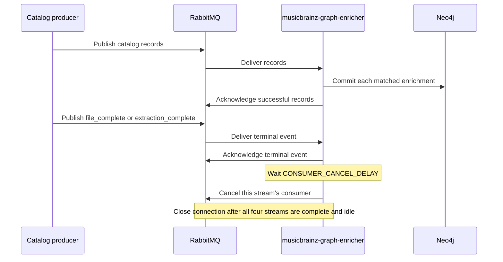

# Consumer cancellation and draining

`musicbrainz-graph-enricher` manages one RabbitMQ consumer for each MusicBrainz entity stream.
Consumers stop after completed streams and before process teardown, preventing unnecessary broker
activity and preserving deliveries during routine restarts.

## Completion lifecycle

`CONSUMER_CANCEL_DELAY` defaults to 300 seconds. A new terminal event replaces an existing
cancellation timer for the same stream. Setting the value to `0` disables completion-driven
cancellation while leaving shutdown cancellation intact.

After every stream is complete and its consumer has been cancelled, the service closes its
RabbitMQ channel and connection. The periodic queue checker reconnects at
`QUEUE_CHECK_INTERVAL`, checks for pending messages, and restores all required consumers when
new work appears.

## Stuck-state recovery

Every `STUCK_CHECK_INTERVAL`, the service detects the state where messages have been processed,
some streams remain incomplete, and no consumers are registered. It marks health unhealthy while
recovering the broker connection and consumer set. A recovery failure clears stale consumer tags
so a later check can retry instead of reporting false health.

## Process shutdown

Signal handling sets the shutdown flag. The main teardown path then cancels every registered
consumer before stopping background work and closing Neo4j. A delivery observed after shutdown
has begun is left unacknowledged; closing the connection returns it to RabbitMQ once.

This order protects the quorum queue's 20-delivery budget. Repeatedly nacking while a consumer is
still subscribed can immediately redeliver the same message and exhaust that budget. The
shutdown-delivery-churn regression test preserves this behavior.
