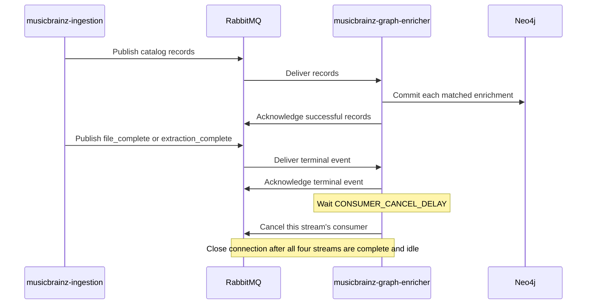

# Consumer cancellation

`musicbrainz-graph-enricher` manages one RabbitMQ consumer for each MusicBrainz entity stream.
Consumers stop after completed streams and before process teardown, preventing unnecessary broker
activity and preserving deliveries during routine restarts.

## Completion lifecycle

```mermaid
sequenceDiagram
    participant Producer as musicbrainz-ingestion
    participant Broker as RabbitMQ
    participant Enricher as musicbrainz-graph-enricher
    participant Neo4j

    Producer->>Broker: Publish catalog records
    Broker->>Enricher: Deliver records
    Enricher->>Neo4j: Commit each matched enrichment
    Enricher->>Broker: Acknowledge successful records
    Producer->>Broker: Publish file_complete or extraction_complete
    Broker->>Enricher: Deliver terminal event
    Enricher->>Broker: Acknowledge terminal event
    Note over Enricher: Wait CONSUMER_CANCEL_DELAY
    Enricher->>Broker: Cancel this stream's consumer
    Note over Enricher,Broker: Close connection after all four streams are complete and idle
```

`CONSUMER_CANCEL_DELAY` defaults to 300 seconds. A new terminal event replaces an existing
cancellation timer for the same stream. Setting the value to `0` disables completion-driven
cancellation while leaving shutdown cancellation intact.

After every stream is complete and its consumer has been cancelled, the service closes its
RabbitMQ channel and connection. The periodic queue checker reconnects at
`QUEUE_CHECK_INTERVAL`, checks for pending messages, and restores all required consumers when
new work appears.

## Stuck-state recovery

Every `STUCK_CHECK_INTERVAL`, `_consumer_alarm_types()` reports the incomplete data types whose
consumer is missing entirely, or that has a registered consumer but never received a single
delivery once every sibling data type has finished. Either condition marks the health payload
`unhealthy` (`consumer_alarm_types` names the affected types, `current_task` reads
`STUCK - consumers died, awaiting recovery`) and triggers `_recover_consumers()`.

This replaces the older gate, which required at least one message to have been processed
*anywhere* before it would report anything. That gate could not see a data type whose consumer
never registered at all -- its own message count stayed at zero forever, and other data types'
consumers kept the overall "no active consumers" check from ever tripping. A production
extraction run this way silently parked 4.46M `release-groups` events behind a healthy
healthcheck: the `artists`, `labels`, and `releases` streams kept the service looking healthy
while `release-groups` had no consumer at all.

A never-registered consumer is only reported once `STARTUP_IDLE_TIMEOUT` seconds have passed
since the current connection's consumers began registering (tracked in
`consumer_watch_started_at`), so a data type still starting up is not flagged before every
consumer has had a chance to subscribe. The pre-existing "all consumers died after messages were
already flowing" case is still reported immediately, unchanged.

A recovery failure clears stale consumer tags so a later check can retry instead of reporting
false health.

### Consumer registration and teardown logging

Every successful `queue.consume()` call logs `"✅ Registered RabbitMQ consumer"` with the data
type, its durable queue name, the broker-assigned consumer tag, and whether the registration
happened during recovery (`recovered=True/False`). Closing the RabbitMQ connection logs
`"🔧 Closing RabbitMQ connection"` with both the full set of tags registered on that connection
(`registered_consumer_tags`) and the subset still active at close (`active_consumer_tags`),
before the registration set is cleared for the next connection. Dropping a broken connection to
recover also logs `"🔌 Dropping RabbitMQ connection for consumer recovery"` with the same two
sets. Together these distinguish "this data type's consumer never registered" from "it
registered, then was cancelled or dropped" without depending on the health endpoint.

See [`gm-musicbrainz-sql-loader-dg-cev8`](https://github.com/groovemap-music/musicbrainz-sql-loader)
for the companion fix applied to `brainztableinator`, the SQL loader's own consumer for the same
MusicBrainz catalog streams: the same silent-starvation gate and the same registration/teardown
logging shape, applied independently to that service's own declarations and detector.

## Process shutdown

Signal handling sets the shutdown flag. The main teardown path then cancels every registered
consumer before stopping background work and closing Neo4j. A delivery observed after shutdown
has begun is left unacknowledged; closing the connection returns it to RabbitMQ once.

This order protects the quorum queue's 20-delivery budget. Repeatedly nacking while a consumer is
still subscribed can immediately redeliver the same message and exhaust that budget. The
shutdown-delivery-churn regression test preserves this behavior.
