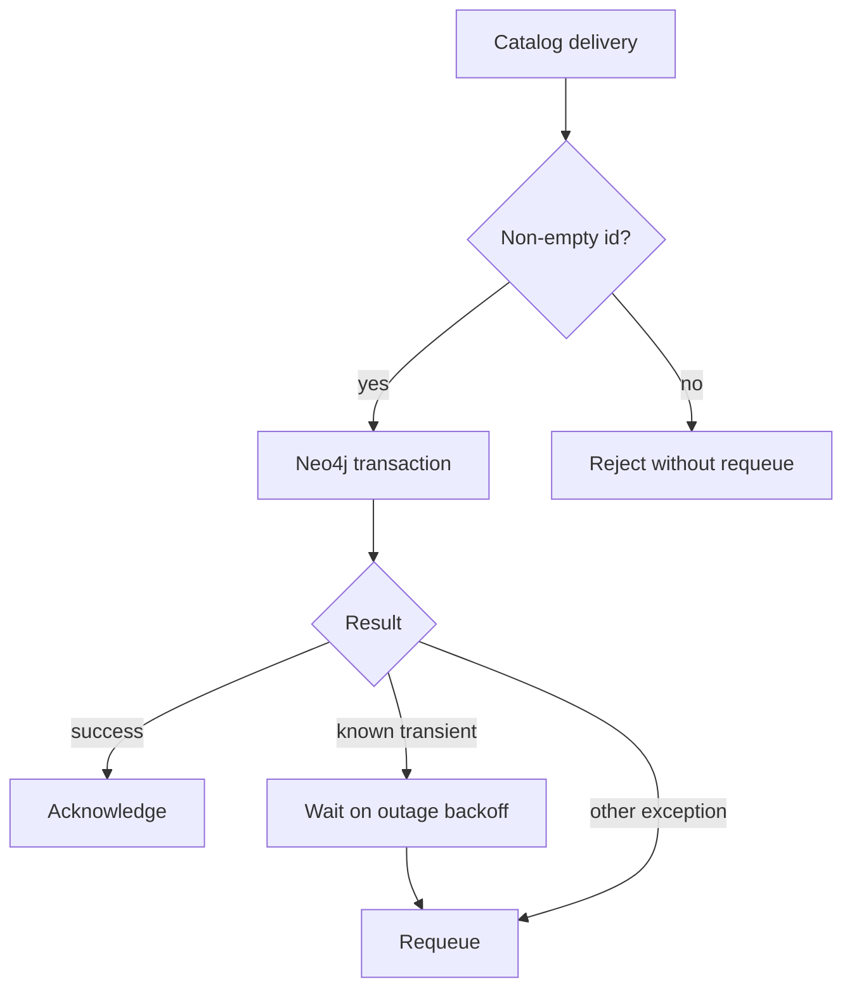

# Failure handling and database resilience

`musicbrainz-graph-enricher` acknowledges a catalog delivery only after its Neo4j transaction
succeeds. Its RabbitMQ and Neo4j adapters come from `groovemap-runtime`; the service adds
delivery classification and recovery behavior around those adapters.

## Delivery outcomes

| Outcome | Broker action | Reason |
| --- | --- | --- |
| Neo4j transaction succeeds | `ack` | The graph change is committed |
| Missing or empty record `id` | `nack(requeue=False)` | Retrying an invalid identifier cannot repair it |
| Malformed JSON | `nack(requeue=True)` | Parsing follows the generic processing-exception path |
| `ServiceUnavailable`, `SessionExpired`, or `DatabaseUnavailableError` | outage backoff, then `nack(requeue=True)` | The dependency failure is transient |
| Other processing exception | `nack(requeue=True)` | Preserve the record for another attempt |
| Shutdown begins before processing | leave unacknowledged | Connection close returns it once without redelivery churn |

Main queues are durable quorum queues with `x-delivery-limit=20`. Their dead-letter exchange and
queue use the same durable v1 consumer identifier. Outage backoff throttles transient database
requeues so a temporary Neo4j outage does not consume all 20 attempts in seconds.

Successful Neo4j work resets the outage backoff. Enrichment counters are collected per delivery
and merged into shared health state after the transaction completes but before the broker
acknowledgement. Transaction retries do not inflate counts. An acknowledgement failure can requeue
an already committed delivery after its counters were merged, so health counters are operational
telemetry rather than an exactly-once accounting ledger.

## Connection startup and recovery

Startup verifies Neo4j connectivity, then makes up to five RabbitMQ connection attempts with an
increasing wait capped at 30 seconds. The resilient RabbitMQ adapter also receives retry and
heartbeat settings. After completion-driven idle shutdown, the periodic checker briefly reconnects
and passively checks every queue. If any queue has work, it declares the full consumer topology and
starts a consumer for every stream, including streams that were empty at the instant of the check.

This repository's default tests mock both external boundaries. Operational validation against live
RabbitMQ and Neo4j belongs to the deployment stack and is intentionally separate from `just check`.
