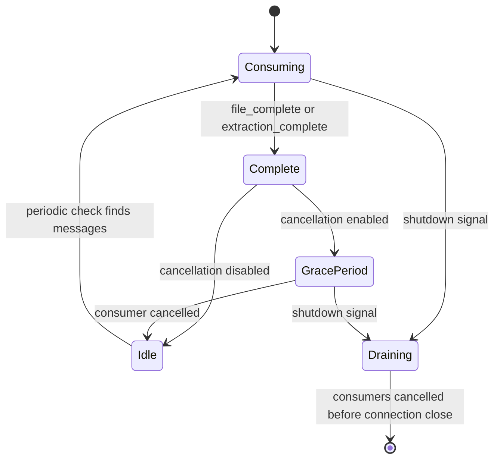

# Completion signals and health state

The catalog-event contract carries two terminal control messages. They coordinate consumer
lifecycle; they are not graph records and do not run an enrichment transaction.

## `file_complete`

A `file_complete` event names the entity stream and may include `total_processed`. The service:

1. logs the producer's processed count;
2. schedules cancellation after `CONSUMER_CANCEL_DELAY` when enabled;
3. records the stream in `completed_files`; and
4. acknowledges the event.

The completion flag is set after scheduling so stuck-state detection still observes work that is
in flight during the grace period.

## `extraction_complete`

An `extraction_complete` event is also terminal for the stream. The service records the stream as
complete even if a restart or consumer recovery removed an earlier `file_complete` marker, then
schedules cancellation and acknowledges the event. This prevents a completed stream from being
reported as permanently stuck.

Unlike other graph consumers, this service does not delete stub nodes on
`extraction_complete`; it only enriches already matched nodes.

## Health interpretation

The health payload contains:

- `service`: `musicbrainz-graph-enricher`;
- `message_counts` and `last_message_time` by entity stream;
- `active_consumers` and `completed_files`;
- `enrichment_stats`; and
- `current_task`, including idle, startup, or stuck status.

A service with no Neo4j driver is `starting` before any work and `unhealthy` after activity. A
missing-consumer state is unhealthy when some streams are incomplete and at least one message has
already been processed. Otherwise a connected service is healthy, including a completed idle run.
