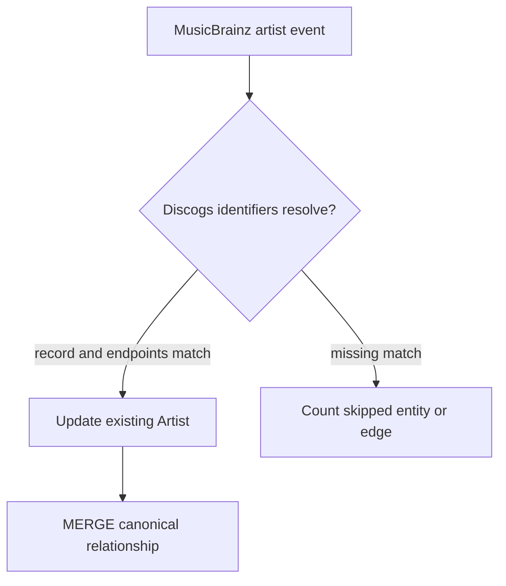

# Graph enrichment

`musicbrainz-graph-enricher` updates existing GrooveMap Neo4j nodes only when a MusicBrainz
event carries the corresponding Discogs identifier. An unmatched record is acknowledged and
counted as `entities_skipped_no_discogs_match`; it does not create a new node.

## Node properties

| Node | Match input | MusicBrainz properties written |
| --- | --- | --- |
| `Artist` | `discogs_artist_id` | `mbid`, `mb_type`, `mb_gender`, begin/end dates and areas, `mb_area`, `mb_disambiguation`, `mb_updated_at` |
| `Label` | `discogs_label_id` | `mbid`, `mb_type`, `mb_label_code`, begin/end dates, `mb_area`, `mb_updated_at` |
| `Master` | `discogs_master_id` | `mbid`, `mb_type`, `mb_secondary_types`, `mb_first_release_date`, `mb_disambiguation`, `mb_updated_at` |
| `Release` | `discogs_release_id` | `mbid`, `mb_barcode`, `mb_status`, `mb_release_group_mbid`, `mb_updated_at` |

Discogs identifiers are converted to strings before matching because GrooveMap graph nodes use
string `id` properties.

## Relationship outputs

Artist events may create these canonical edges:

| MusicBrainz relation | Neo4j edge |
| --- | --- |
| member of band | `MEMBER_OF` |
| collaboration | `COLLABORATED_WITH` |
| teacher | `TAUGHT` |
| tribute | `TRIBUTE_TO` |
| founder | `FOUNDED` |
| supporting musician | `SUPPORTED` |
| subgroup | `SUBGROUP_OF` |
| artist rename | `RENAMED_TO` |

Both endpoints must resolve to existing `Artist` nodes. Edges are merged idempotently and carry
`source: 'musicbrainz'`. Backward MusicBrainz relations swap their endpoints before creation so
the stored edge follows the canonical direction.

## Health counters

The health response exposes `entities_enriched`, `entities_skipped_no_discogs_match`,
`relationships_created`, `relationships_updated`, and `relationships_skipped_missing_side`.
The service merges counters into health state after a successful Neo4j transaction and before
acknowledging the delivery. If that acknowledgement fails, the generic error path may requeue an
already committed delivery and a later retry may increment its counters again. These values are
operational telemetry, not exactly-once accounting.
