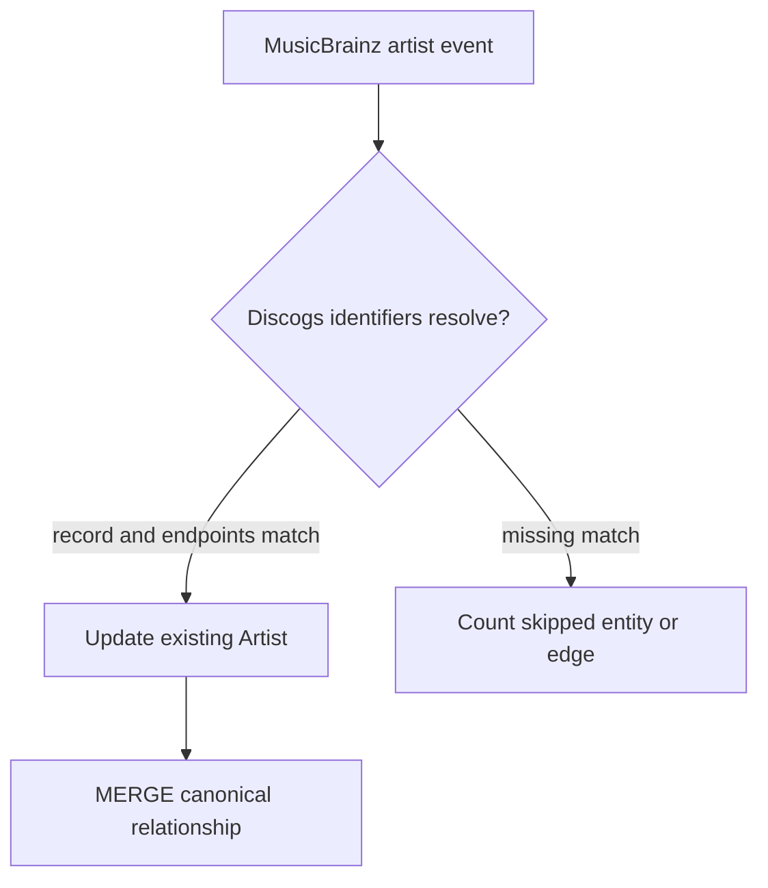

# Graph enrichment

`musicbrainz-graph-enricher` updates existing GrooveMap Neo4j nodes only when a MusicBrainz
event carries the corresponding Discogs identifier. An unmatched record is acknowledged and
counted as `entities_skipped_no_discogs_match`; it does not create a new node.

## Node properties

| Node | Match input | MusicBrainz properties written |
| --- | --- | --- |
| `Artist` | `discogs_artist_id` | `mbid`, `mb_type`, `mb_gender`, begin/end dates and areas, `mb_area`, `mb_disambiguation`, `mb_updated_at` |
| `Label` | `discogs_label_id` | `mbid`, `mb_type`, `mb_label_code`, begin/end dates, `mb_area`, `mb_updated_at` |
| `Master` | `discogs_master_id` | `mbid`, `mb_type`, `mb_secondary_types`, `mb_first_release_date`, `mb_disambiguation`, `mb_updated_at` |
| `Release` | `discogs_release_id` | `mbid`, `mb_barcode`, `mb_status`, `mb_release_group_mbid`, `mb_updated_at`, `mb_media_families`, `mb_medium_count` |

Discogs identifiers are converted to strings before matching because GrooveMap graph nodes use
string `id` properties.

## Relationship outputs

Artist events may create these canonical edges:

| MusicBrainz relation | Neo4j edge |
| --- | --- |
| member of band | `MEMBER_OF` |
| collaboration | `COLLABORATED_WITH` |
| teacher | `TAUGHT` |
| tribute | `TRIBUTE_TO` |
| founder | `FOUNDED` |
| supporting musician | `SUPPORTED` |
| subgroup | `SUBGROUP_OF` |
| artist rename | `RENAMED_TO` |

Both endpoints must resolve to existing `Artist` nodes. Edges are merged idempotently and carry
`source: 'musicbrainz'`. Backward MusicBrainz relations swap their endpoints before creation so
the stored edge follows the canonical direction.

## Media outputs

A matched release also carries its canonical media (ADR 0007) into the graph. The event's
`media` block is the vocabulary's verdict on the release's mediums; the enricher writes it as
nodes and edges rather than re-deriving it:

| Output | Shape |
| --- | --- |
| `Medium` | Merged on the canonical medium id, with `family` and `label` set on creation only |
| `MediaFamily` | Merged on the family name |
| `(:Medium)-[:IN_FAMILY]->(:MediaFamily)` | Files each medium under its family |
| `(:Release)-[:ISSUED_ON {qty, source}]->(:Medium)` | Merged with `source: 'musicbrainz'`, `qty` the number of that medium the release has |
| `Release.mb_media_families` | The block's sorted family ids |
| `Release.mb_medium_count` | The number of items in the canonical media block — see Quantity and counting |

`Medium` and `MediaFamily` nodes are shared with the Discogs graph enricher on purpose. Both
services key them on the same vocabulary ids, so a medium is one node no matter which catalog
first saw it. Medium properties are written `ON CREATE` only, so neither enricher rewrites the
other's node on every event.

The edges are not shared. `source` is part of the `ISSUED_ON` merge pattern, not a property set
afterwards, so a release known to both catalogs holds one edge per catalog to the same medium
and the API can reconcile the two. A Discogs-sourced edge is never matched, updated, or
deleted here.

### Reconciling a change

MusicBrainz media are reconciled, not just added. Every enrichment of a matched release deletes
the `ISSUED_ON` edges it previously wrote that the current block no longer lists, scoped by
`source` and by the new medium id set. A release recatalogued from vinyl to digital therefore
ends with one digital edge, not a contradiction; a Discogs edge to the dropped vinyl medium
survives untouched.

A block carrying no items is an authoritative statement that MusicBrainz knows no media for the
release: the summary is emptied and every musicbrainz-sourced edge is removed. An event with no
media block at all is different — nothing is known, so the release's media properties and edges
are left exactly as they were.

### Quantity and counting

MusicBrainz lists one entry per physical medium, each of quantity one, so a 2xLP arrives as two
`vinyl_unspecified` entries. The graph holds at most one musicbrainz-sourced edge per release
and medium, so entries sharing a medium are summed onto that edge: the 2xLP is one edge of
`qty` 2. `mb_medium_count` counts source mediums rather than edges, so it reads 2 for the same
release.

`mb_medium_count` is the length of the canonical media block's `items` list, not a raw count of
what MusicBrainz sent. The shared runtime mapper drops a medium whose MusicBrainz format string
is not in the vocabulary into the block's `unmapped.formats` list instead of `items`, so that
medium contributes 0 to `mb_medium_count` and gets no `Medium` node or `ISSUED_ON` edge either —
an unrecognized format is invisible to the count, not folded into an "other" bucket. A medium
with no format at all is different: it maps to `other_unspecified` and is counted normally.

### Events that predate the block

An event published before the producer computed the block carries only the raw medium list in
`media_raw`. The enricher derives the block from it through the shared runtime mapper, the same
one the producer runs, so a replayed backlog lands the same media as a fresh event. An event
with neither field contributes no media.

## Health counters

The health response exposes `entities_enriched`, `entities_skipped_no_discogs_match`,
`relationships_created`, `relationships_updated`, and `relationships_skipped_missing_side`.
The service merges counters into health state after a successful Neo4j transaction and before
acknowledging the delivery. If that acknowledgement fails, the generic error path may requeue an
already committed delivery and a later retry may increment its counters again. These values are
operational telemetry, not exactly-once accounting.
