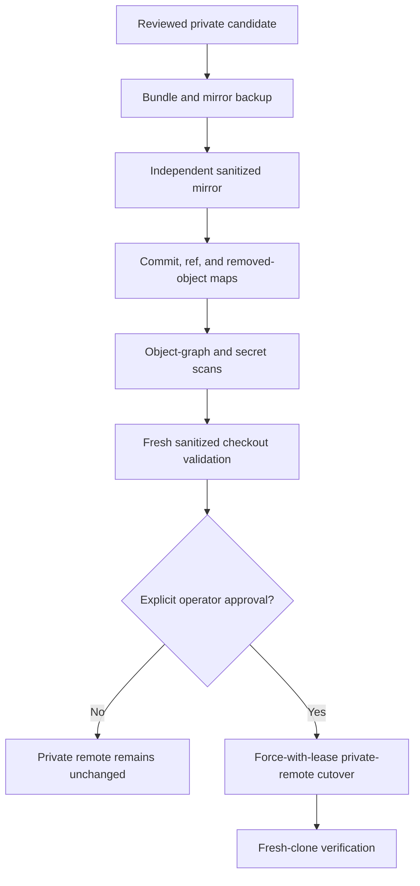

# History rewrite approval gate

History sanitation runs only in separate backup and sanitized clones. It removes raw private
planning paths from every reachable commit while the private `planning-archive` repository at
commit `daf82a149aaa382b3cebbd4b43d3c82e53d4128e` preserves the source records,
including the canonical readable `docs/superpowers/` and `docs/specs/` trees.

The operator must approve the exact old-to-new map, expected remote values, rollback backup,
and cutover before any remote rewrite. Remote drift invalidates the rehearsal. Repository
visibility, tags, releases, packages, and container publication are separate approvals.
