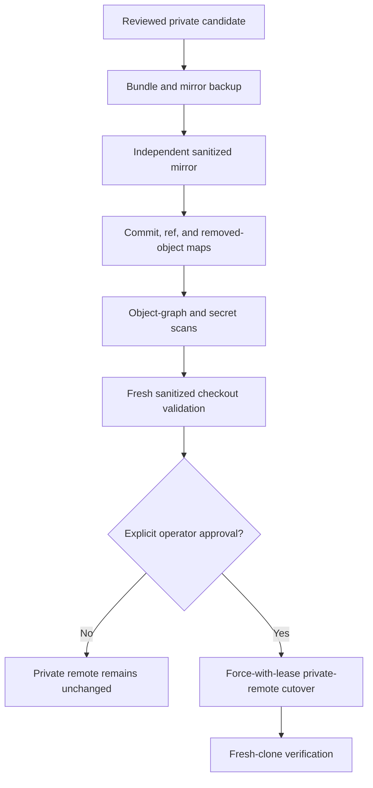

# History rewrite approval gate

History sanitation runs only in separate backup and sanitized clones. It removes raw private
planning paths from every reachable commit while the private `planning-archive` repository at
commit `4d0ecef0a798aab2f769cb5eb2e93982236f4f91` preserves the source records.

The operator must approve the exact old-to-new map, expected remote values, rollback backup,
and cutover before any remote rewrite. Remote drift invalidates the rehearsal. Repository
visibility, tags, releases, packages, and container publication are separate approvals.
