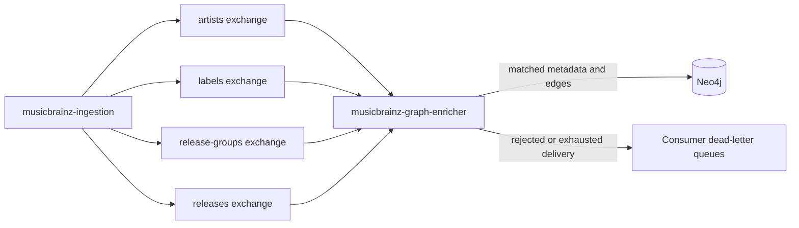

# MusicBrainz event flow

This repository owns the consumer that projects matched MusicBrainz catalog data into the
GrooveMap Neo4j graph. Downloading, parsing, and publishing belong to
[`musicbrainz-ingestion`](https://github.com/groovemap-music/musicbrainz-ingestion), while
storing the full relational catalog belongs to
[`musicbrainz-sql-loader`](https://github.com/groovemap-music/musicbrainz-sql-loader).

## Input streams

The promoted v1 catalog-event contract defines four fanout exchanges.
`MUSICBRAINZ_EXCHANGE_PREFIX` can replace the default prefix. Each exchange binds one durable
quorum queue for this consumer, plus a consumer-owned fanout dead-letter exchange and classic
dead-letter queue.

| Stream | Exchange | Consumer queue | Dead-letter exchange / queue |
| --- | --- | --- | --- |
| `artists` | `groovemap-musicbrainz-artists` | `groovemap-musicbrainz-brainzgraphinator-artists` | `groovemap-musicbrainz-brainzgraphinator-artists.dlx` / `groovemap-musicbrainz-brainzgraphinator-artists.dlq` |
| `labels` | `groovemap-musicbrainz-labels` | `groovemap-musicbrainz-brainzgraphinator-labels` | `groovemap-musicbrainz-brainzgraphinator-labels.dlx` / `groovemap-musicbrainz-brainzgraphinator-labels.dlq` |
| `release-groups` | `groovemap-musicbrainz-release-groups` | `groovemap-musicbrainz-brainzgraphinator-release-groups` | `groovemap-musicbrainz-brainzgraphinator-release-groups.dlx` / `groovemap-musicbrainz-brainzgraphinator-release-groups.dlq` |
| `releases` | `groovemap-musicbrainz-releases` | `groovemap-musicbrainz-brainzgraphinator-releases` | `groovemap-musicbrainz-brainzgraphinator-releases.dlx` / `groovemap-musicbrainz-brainzgraphinator-releases.dlq` |

Queue names retain `brainzgraphinator` as the v1 consumer token, for example
`groovemap-musicbrainz-brainzgraphinator-artists`. This is a wire-compatibility identifier,
not the service's public name. Changing it would create different durable queues and leave the
existing queues unconsumed.

## Record processing and throughput

Data records must have a non-empty `id`. The entity-specific processor matches the relevant
Discogs identifier to an existing graph node, writes MusicBrainz properties, and acknowledges the
delivery after the Neo4j transaction succeeds. Artist relations are written only when both graph
endpoints exist. See [graph enrichment](graph-enrichment.md) for the property and edge mapping.

The shared channel uses a prefetch count of 200 per consumer: each stream can have up to 200
unacknowledged deliveries, for a theoretical maximum of 800 across all four consumers.
Processing is concurrent, but each data delivery uses an independent Neo4j transaction; the
service does not aggregate records into a shared transaction batch. The retained
`NEO4J_BATCH_*` environment variables do not change this behavior.

Measure throughput from the service's pipeline and Neo4j client metrics. Database sizing,
collector storage, and whole-stack performance testing belong to
[`deployment`](https://github.com/groovemap-music/deployment); Neo4j constraints and indexes
belong to [`database-schema`](https://github.com/groovemap-music/database-schema).

## Control events

`file_complete` and `extraction_complete` are terminal control events for one entity stream.
They update completion state, acknowledge the event, and may schedule consumer cancellation.
They do not perform graph cleanup. Details are in [completion signals](file-completion-tracking.md).

## Observability

`http://localhost:8011/health` reports the service status, current task, per-stream message
counts and timestamps, active consumers, completed streams, and enrichment counters. Runtime
logs and health data identify the service as `musicbrainz-graph-enricher`.
