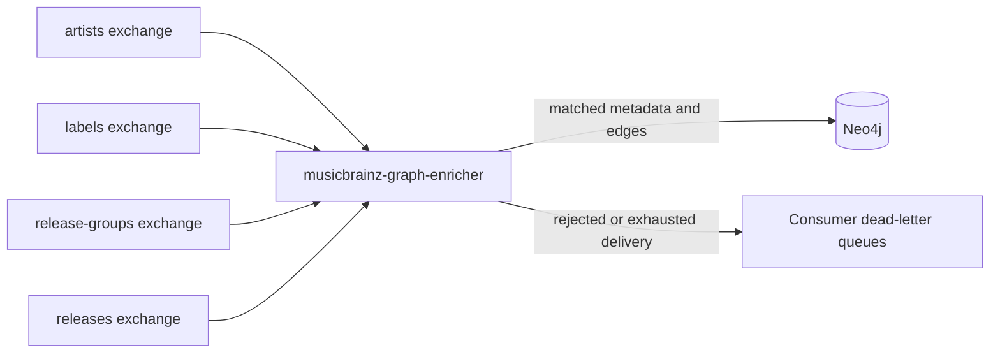

# MusicBrainz event flow

This repository owns the consumer that projects matched MusicBrainz catalog data into the
GrooveMap Neo4j graph. Downloading and parsing MusicBrainz dumps belongs to the upstream catalog
producer; storing the full MusicBrainz catalog belongs to a separate persistence service.

## Input streams

The promoted v1 catalog-event contract defines four fanout exchanges:

- `groovemap-musicbrainz-artists`
- `groovemap-musicbrainz-labels`
- `groovemap-musicbrainz-release-groups`
- `groovemap-musicbrainz-releases`

`MUSICBRAINZ_EXCHANGE_PREFIX` can replace the default prefix. Each exchange binds one durable
quorum queue for this consumer and an associated classic dead-letter queue.

Queue names retain `brainzgraphinator` as the v1 consumer token, for example
`groovemap-musicbrainz-brainzgraphinator-artists`. This is a wire-compatibility identifier,
not the service's public name. Changing it would create different durable queues and leave the
existing queues unconsumed.

## Record processing

Data records must have a non-empty `id`. The entity-specific processor matches the relevant
Discogs identifier to an existing graph node, writes MusicBrainz properties, and acknowledges the
delivery after the Neo4j transaction succeeds. Artist relations are written only when both graph
endpoints exist. See [graph enrichment](graph-enrichment.md) for the property and edge mapping.

The channel uses a prefetch count of 200. Processing is concurrent but each delivery uses an
independent Neo4j transaction; the service does not currently aggregate records into a shared
transaction batch.

## Control events

`file_complete` and `extraction_complete` are terminal control events for one entity stream.
They update completion state, acknowledge the event, and may schedule consumer cancellation.
They do not perform graph cleanup. Details are in [completion signals](file-completion-tracking.md).

## Observability

`http://localhost:8011/health` reports the service status, current task, per-stream message
counts and timestamps, active consumers, completed streams, and enrichment counters. Runtime
logs and health data identify the service as `musicbrainz-graph-enricher`.
